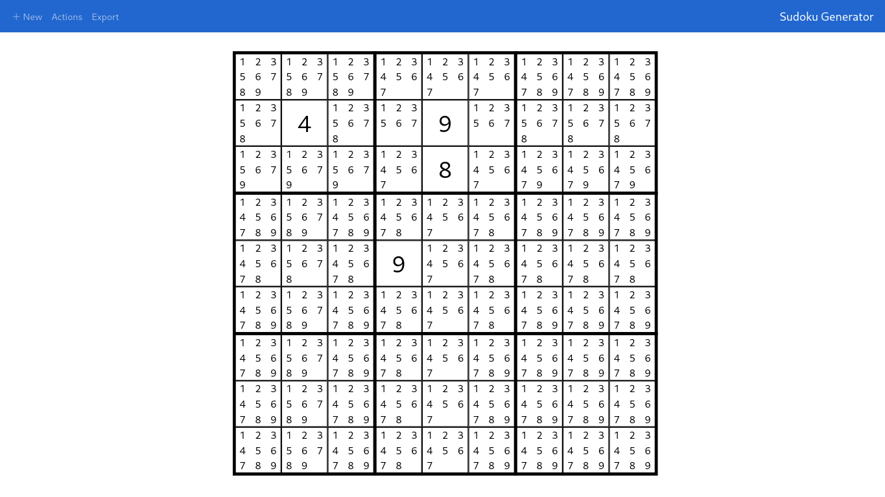

# Sudoku Generator
[](/LICENSE)
[](/)
[](https://sudoku.bliepp.de/#/)

A React based Sudoku generator using the wavefunction collapse algorithm




## Features
* Cross-platform (PWA)
* Support for 4x4, 9x9 and 16x16 Sudokus
* Manual selection ("collapsing") of individual cells
* Statically servable (e.g. via GH Pages) due to being a 100% client side app


## Known issues
* SVG export only works okay-ish. There are still issues with the font.
* If the initial sudoku wavefunction is in an invalid state, the solver will run infinitely. A timeout is yet to be implemented.


## How to build
The project is managed by Vite. Clone the project and run
```console
npm install
npm run build
```
to install the dependencies and generate statically servable files. You can find them in the `build` directory.

The output found in the output folder is meant to be deployed directly on the root of a domain (e.g. `sudoku.example.com/`) rather than on a subpath (e.g. `example.com/sudoku/`). To account for that you must explicitly provide a base path when building, i.e.
```console
npm run build -- --base /sudoku/
```
if the desired result is `example.com/sudoku/`. Please mind the `--` before additional flags are set. You may also set the base path in `vite.config.js` instead, if you prefer.


## How to deploy
How to serve them is up to you. You can use any static file hosting service you like. Simply download the files from the `gh-pages` branch to get the latest version.
> The prebuild files on the `gh-pages` branch are build with the base path `/`, i.e. they are meant to be deployed directly on the root of a domain (e.g. `sudoku.example.com/`). If you wish to host them on a subpath (e.g. `example.com/sudoku/`), you need to build them yourself. Please see the building guide above.

### GitHub Pages
To build the app and directly deploy the to a fresh `gh-pages` branch with no commit history, run
```console
npm run build
npm run deploy -- --cname sudoku.example.com
```
> :warning: **The commit history of the `gh-pages` branch will be permanently deleted**.
This is the default behaviour of the `gh-pages` cli command. For more info have a look at [the official repository](https://github.com/tschaub/gh-pages).

To deploy without a custom domain (i.e. omitting the CNAME file, resulting in a deployment on `username.github.io/reponame/`) run the deploy command without the cname flag. Remember to set the correct base path according to the build guide above:
```console
npm run build -- --base /reponame/
npm run deploy
```

To see a full list of available deployment flags have a look at the help message of the `gh-pages` cli tool:
```console
npx gh-pages --help
```
For more info have a look at [the official repository](https://github.com/tschaub/gh-pages).
